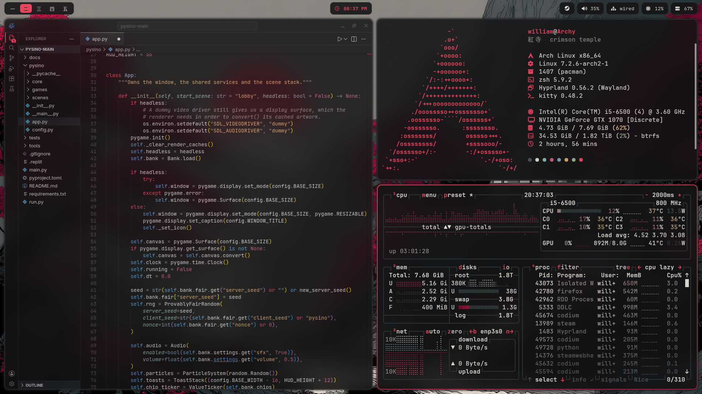
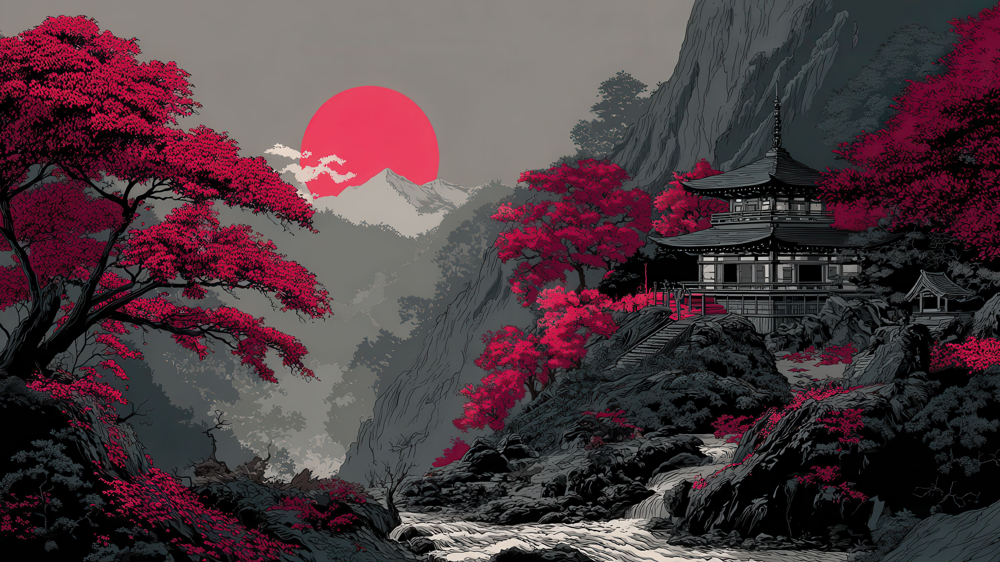

<div align="center">

# 🏯 Crimson Temple Dotfiles

### Arch Linux · Hyprland · a hand-mixed palette pulled from the wallpaper



</div>

---

## Overview

My personal Arch Linux setup, themed **Crimson Temple** a palette I sampled
directly from the wallpaper (dark rocks, grey mist, and the red sun over the
temple) so every component matches the same source. Almost everything is
neutral; red is saved for the one thing that should catch your eye, the way it
works in the painting.

Built from a manual Arch install on an encrypted Btrfs drive, running a fully
hand-configured Hyprland session.

<div align="center">



</div>

## The stack

| Component | Choice |
|---|---|
| **OS** | Arch Linux (manual install) |
| **Disk** | LUKS-encrypted Btrfs, subvolumes + Snapper-ready layout |
| **Compositor** | Hyprland (Lua config) |
| **Bar** | Waybar |
| **Launcher** | Rofi |
| **Notifications** | Mako |
| **Lock** | Hyprlock + Hypridle |
| **Power menu** | wlogout |
| **Terminal** | Kitty |
| **Shell** | Zsh + Starship |
| **Editor** | VSCodium / Neovim (NvChad) |
| **Fetch** | Fastfetch |
| **Monitor** | btop |
| **Bootloader** | GRUB (themed) |
| **GPU** | NVIDIA GTX 1070 (legacy 580xx driver) |

## The palette

Roles, not hues so a re-theme only touches the palette files.

| Role | Hex | From |
|---|---|---|
| Background | `#131314` | Deepest shadows |
| Surface | `#1d2224` | Rock |
| Overlay | `#2c3335` | Lighter rock |
| Text | `#d8d4ce` | Clouds / river |
| Muted | `#8a8681` | Misty sky |
| **Accent** | `#e9445e` | **The sun** |
| Accent (deep) | `#b11d43` | Red leaves |
| Wine | `#5c0f2a` | Darkest leaves |
| Success | `#9aab8f` | Sage (added) |
| Warn | `#d6a36a` | Ochre (added) |
| Info | `#7f95a8` | Slate mist |

*(Sage, ochre, and slate were added for terminal output the wallpaper has no
greens, yellows, or blues, so they're muted to sit quietly in the grey world.)*

## Structure

Managed with [GNU Stow](https://www.gnu.org/software/stow/): each folder mirrors
`$HOME`, and `stow <name>` symlinks it into place.

```
dotfiles/
├── hypr/    # Hyprland: config, palette.lua, hyprlock, hypridle, scripts
├── waybar/   # bar config + style
├── rofi/    # launcher theme
├── mako/    # notification style
├── kitty/   # terminal + Tokyo-Night-to-Crimson colors
├── fastfetch/ # the screenshot fetch
├── btop/    # themed monitor
├── wlogout/  # power menu
├── zsh/    # .zshrc
├── starship/  # prompt
├── vscodium/  # editor colors
├── spicetify/ # Spotify theme
└── grub-theme/ # boot menu (installed separately, to /boot)
```

## Install

> Requires an existing Arch system with the packages below. Review before running 
> these symlink over files in your `$HOME`.

```bash
# 1. Clone
git clone https://github.com/<you>/dotfiles ~/dotfiles
cd ~/dotfiles

# 2. Stow the pieces you want
stow hypr waybar rofi mako kitty fastfetch btop wlogout zsh starship

# 3. GRUB theme (installs to /boot, needs sudo)
cd grub-theme && ./install.sh
```

### Key packages

```
hyprland hyprlock hypridle hyprpaper waybar rofi mako kitty
zsh starship eza bat fzf zoxide fastfetch btop wlogout
ttf-jetbrains-mono-nerd noto-fonts-cjk papirus-icon-theme
nvidia-580xx-dkms  # AUR legacy GPUs only
```

## Notes

- **Palette lives in one place per tool** (`palette.lua`, Waybar's
 `@define-color`, Rofi variables, etc.). Change a color once, it propagates.
- **NVIDIA:** the GTX 1070 (Pascal) needs the AUR `nvidia-580xx` legacy branch;
 the current driver dropped support for it.
- **Hyprland uses the newer Lua config**, not the legacy `hyprland.conf`.

---

<div align="center">
<sub>紅寺 · crimson temple · I use Arch btw</sub>
</div>
